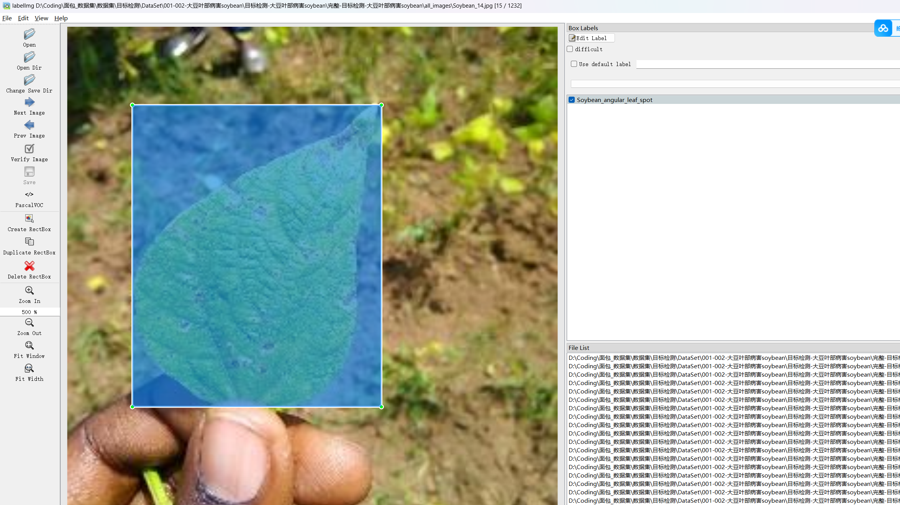

# Soybean Disease Target Detection Dataset

Dataset Information Introduction: There are a total of 1232 images and corresponding annotated files. The annotated files are provided in two formats, including the VOC format's XML file and the YOLO format's txt file.

The target detection dataset consists of the following types of objects to be annotated:
- ['Soybean_angular_leaf_spot', 'Soybean_healthy', 'Soybean_rust']

The number of bounding box information is as follows: (The English labels are usually marked, and the Chinese names inside parentheses provide a reference.)
- Soybean_angular_leaf_spot: 711
- Soybean_healthy: 425
- Soybean_rust: 750

Note that multiple objects may be labeled on one image, so the total number of bounding boxes might be greater than the total number of images.

The complete dataset includes three folders and one txt file:
- all_images folder stores the images of the dataset, with screenshots shown below.
- All_txt folder and classes.txt: store the YOLO format's txt annotated files, in the same quantity as the images, each annotated file corresponds to one.
- classes.txt:

For detailed understanding of the YOLO format standard file, please search for it yourself on Baidu. In short, the number 0 represents the name at index 0 in the array in classes.txt.

All_xml folder: The VOC format's XML annotated file. The quantity matches those in the images, each annotated file corresponds to one.

For detailed understanding of the VOC format standard file, please search for it yourself on Baidu.

Both formats of annotations can be used, choose one according to your preference.

Annotation Screenshots:

## Images

Here is a pay link on Stripe ( https://buy.stripe.com/3cs8yP7sY87d0vu9AB ). Please contact me lonlonago@foxmail.com after funding $89, and I will send you a complete data files , thank you!

